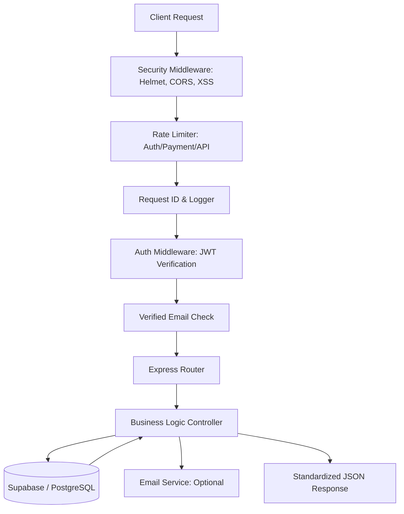

# AI Context — CustomForge (The Master Reference)

---

## 🔹 LAYER 1 — HIGH-LEVEL (FAST UNDERSTANDING)

### 1. Project Overview

CustomForge is a high-performance, enterprise-grade e-commerce ecosystem designed for the gaming hardware and digital software market. It is built to handle complex product specifications (PCs vs Games), secure financial transactions, and provide deep administrative insights.

- **System Nature**: Modular Monolith Backend (Express) + Decoupled Frontends (Next.js).
- **Core Modules**:
  - **Auth & Identity**: 2FA, Email Verification, Session Management.
  - **Catalog & Inventory**: Multi-category support with atomic stock locking.
  - **Fulfillment**: Multi-gateway payment (Stripe/PayPal/COD) + Step-by-step order lifecycle.
  - **Engagement**: Coupon engine, User Wishlists, and Verified Review system.
  - **Intelligence**: Admin dashboard with real-time sales, user, and inventory analytics.

### 2. Tech Stack (Comprehensive)

| Layer | Technologies | Key Role |
| :--- | :--- | :--- |
| **Frontend (Store)** | Next.js 15, Zustand, TanStack Query, Tailwind v4 | High-performance, SEO-optimized storefront. |
| **Frontend (Admin)** | Next.js 15, Shadcn UI, Recharts | Data-heavy management dashboard. |
| **Backend** | Node.js, Express.js | API gateway and business logic orchestrator. |
| **Database** | Supabase (PostgreSQL) | Relational data storage and atomic operations. |
| **Real-time** | Supabase Realtime | Live stock and order updates. |
| **Security** | JWT, Bcrypt, Speakeasy, Helmet, XSS-clean | Multi-layered defense in depth. |
| **Payments** | Stripe (Intents/Webhooks), PayPal SDK | Financial transaction processing. |
| **Media** | Cloudinary | Global asset hosting and optimization. |
| **Email** | Nodemailer (Pug Templates) | Transactional and marketing communication. |

### 3. System Architecture & Request Lifecycle

CustomForge uses a middleware-first approach to ensure every request is validated, logged, and secured before reaching the business logic.

---

## 🔹 LAYER 2 — CORE SYSTEM DETAILS

### 4. Database Schema (The Complete Record)

#### **Identity & Profiles**

- **`users`**:
  - `id (UUID, PK)`: Unique identifier.
  - `name (text)`, `email (text, Unique)`, `password (text)`: Hashed credentials.
  - `role (text)`: 'user' (default) or 'admin'.
  - `is_email_verified (bool)`: Required for ordering.
  - `two_factor_enabled (bool)`, `two_factor_secret (text)`: TOTP configuration.
  - `stripe_customer_id (text)`: Linked Stripe identity.
  - `active (bool)`: Soft-deletion flag.

- **`user_addresses`**: `id`, `user_id (FK)`, `label`, `full_name`, `address`, `city`, `state`, `postal_code`, `country`, `phone_number`, `is_default`.
- **`user_payment_methods`**: `id`, `user_id (FK)`, `type`, `card_holder_name`, `card_number (Masked)`, `expiry_month`, `expiry_year`, `is_default`.
- **`user_wishlist`**: `id`, `user_id (FK)`, `product_id (FK)`. (Unique on user+product)

#### **Catalog & Product Metadata**

- **`products`**:
  - `id (UUID, PK)`, `name (text)`, `sku (text, Unique)`, `category (text)`, `brand (text)`
  - `specifications (JSONB)`: Dynamic hardware/software specs.
  - `original_price (numeric)`, `discount_percentage (numeric)`, `final_price (numeric)`
  - `stock (int)`, `availability (text)`: 'In Stock', 'Out of Stock', etc.
  - `images (text[])`, `description (text)`, `features (text[])`
  - `ratings (JSONB)`: `{ "average": 0, "totalReviews": 0 }`
  - `sales_count (int)`: Tracking popularity.

- **`games`**: `product_id (FK)`, `genre[]`, `platform[]`, `developer`, `publisher`, `release_date`, `age_rating`, `system_requirements (JSONB)`.
- **`prebuilt_pcs`**: `product_id (FK)`, `cpu (JSONB)`, `gpu (JSONB)`, `ram (JSONB)`, `storage (JSONB)`, `power_supply (JSONB)`, `cooling_system (JSONB)`.

#### **Marketing & Transactions**

- **`coupons`**: `id`, `code (Unique)`, `discount_type`, `discount_value`, `min_purchase`, `usage_limit`, `times_used`, `per_user_limit`.
- **`carts`**: `id`, `user_id (Unique FK)`, `coupon_id (FK)`.
- **`cart_items`**: `id`, `cart_id (FK)`, `product_id (FK)`, `quantity`.
- **`orders`**:
  - `id (UUID, PK)`, `user_id (FK)`, `status`: 'pending', 'paid', 'processing', 'shipped', 'delivered', 'cancelled', 'refunded'.
  - `items_price`, `discount_amount`, `shipping_price`, `tax_price`, `total_price`.
  - `is_paid (bool)`, `paid_at (timestamptz)`, `idempotency_key (text, Unique)`.
  - `shipping_address (JSONB)`, `payment_method`, `payment_result (JSONB)`.

- **`order_items`**: `id`, `order_id (FK)`, `product_id (FK)`, `name`, `price`, `quantity`, `price_snapshot`.
- **`reviews`**: `id`, `product_id (FK)`, `user_id (FK)`, `rating`, `title`, `comment`, `verified_purchase (bool)`, `media (text[])`.

---

### 5. API Reference (Ultimate Catalog)

All routes are prefixed with `/api/v1`.

#### **Auth & Identity (`/auth`)**

| Endpoint | Method | Auth | Description |
| :--- | :--- | :--- | :--- |
| `/register` | POST | None | Creates user account + sends verification email. |
| `/login` | POST | None | Authenticates user (uses `loginLimiter`). |
| `/logout` | GET | None | Clears JWT cookie. |
| `/verify-email/:token` | GET | None | Activates account via token. |
| `/send-verification-email` | POST | Protect | Resends email verification link. |
| `/forgot-password` | POST | None | Generates reset token and emails user. |
| `/reset-password/:token` | POST | None | Consumes token to update password. |
| `/refresh` | POST | Protect | Issues a fresh JWT to extend session. |
| `/update-password` | PATCH | 2FA | Updates password (requires 2FA if enabled). |
| `/2fa/enable` | POST | Protect | Step 1: Generates TOTP secret/QR code. |
| `/2fa/verify` | POST | Protect | Step 2: Finalizes 2FA setup with code. |
| `/2fa/disable` | DELETE | 2FA | Deactivates 2FA. |

#### **User & Profile (`/users`)**

| Endpoint | Method | Auth | Description |
| :--- | :--- | :--- | :--- |
| `/profile` (or `/me`) | GET | Protect | Fetches current user profile. |
| `/profile` | PATCH | 2FA | Updates user metadata (name, email, etc.). |
| `/change-password` | PATCH | 2FA | Alias for password update. |
| `/delete-account` | DELETE | 2FA | Deactivates user account. |
| `/wishlist` | GET | Protect | Fetches user's saved products. |
| `/wishlist/:productId` | POST/DEL | Protect | Manage items in wishlist. |
| `/orders` (or `/my-orders`) | GET | Protect | User's personal order history. |
| `/addresses` | GET/POST | Protect | Manage shipping addresses. |
| `/addresses/:id` | PATCH/DEL | Protect | Update or remove specific address. |
| `/addresses/:id/default` | PATCH | Protect | Set an address as primary. |
| `/payment-methods` | GET/POST | Protect | Manage saved Stripe cards. |
| `/payment-methods/:id` | PATCH/DEL | Protect | Update or remove specific card. |
| `/payment-methods/:id/default` | PATCH | Protect | Set a card as primary. |

#### **Catalog & Search (`/products`)**

| Endpoint | Method | Auth | Description |
| :--- | :--- | :--- | :--- |
| `/` | GET | None | List products (Supports search, filter, paginate). |
| `/top` | GET | None | Fetch best selling/highest rated products. |
| `/search` | GET | None | Alias for search functionality. |
| `/categories` | GET | None | List all product categories. |
| `/featured` | GET | None | Fetch products marked as featured. |
| `/category/:category` | GET | None | List products by specific category. |
| `/:id` | GET | None | Full details for a single product. |
| `/:id/related` | GET | None | Get product recommendations. |
| `/:id/wishlist` | POST/DEL | Protect | Alternative wishlist management. |
| `/:id/reviews` | POST | Protect | Create a product review. |

#### **Shopping Cart (`/cart`)**

| Endpoint | Method | Auth | Description |
| :--- | :--- | :--- | :--- |
| `/` | GET | Protect | Get cart contents + preview totals. |
| `/add` | POST | Protect | Add item (body: `{ productId, quantity }`). |
| `/` | DELETE | Protect | Empty entire cart. |
| `/update` | PATCH | Protect | Update item quantity. |
| `/remove/:id` | DELETE | Protect | Remove specific item. |
| `/coupon` | POST | Protect | Apply coupon code for preview. |
| `/coupon` | DELETE | Protect | Remove current coupon. |

#### **Orders & Fulfillment (`/orders`)**

| Endpoint | Method | Auth | Description |
| :--- | :--- | :--- | :--- |
| `/` | POST | Protect | Create order from cart (Atomic stock lock). |
| `/` | GET | Protect | Fetch my order history. |
| `/:id` | GET | Protect | Fetch specific order details. |
| `/:id/payment-status` | GET | Protect | Poll for payment success/failure. |
| `/cancel/:id` | POST | Protect | Cancel a pending/unshipped order. |
| `/request-return/:id` | POST | Protect | Initiate a return for delivered items. |

#### **Payments & Transactions (`/payment`)**

| Endpoint | Method | Auth | Description |
| :--- | :--- | :--- | :--- |
| `/process` | POST | Protect | Execute payment logic (Stripe/PayPal/COD). |
| `/create-intent` | POST | Protect | Get Stripe `clientSecret` for UI. |
| `/create-stripe-session` | POST | Protect | Create a Stripe Checkout session. |
| `/create-order-cod` | POST | Protect | Create order with Cash on Delivery. |
| `/paypal/create-order` | POST | Protect | Initiate PayPal order. |
| `/paypal/capture-order` | POST | Protect | Finalize PayPal transaction. |
| `/payment-methods` | GET/POST | Protect | Manage user's Stripe payment methods. |
| `/webhook` | POST | None | **STRIPE ONLY**: Raw body webhook handler. |

#### **Reviews & Engagement (`/reviews`)**

| Endpoint | Method | Auth | Description |
| :--- | :--- | :--- | :--- |
| `/products/:id/reviews` | GET | None | Publicly view product reviews. |
| `/:reviewId` | PATCH | Protect | Edit own review. |
| `/:reviewId` | DELETE | Protect | Delete own review. |

#### **Administration & Management (`/admin`)**

| Endpoint | Method | Auth | Description |
| :--- | :--- | :--- | :--- |
| `/analytics/overview` | GET | Admin | Platform-wide metrics summary. |
| `/analytics/sales` | GET | Admin | Revenue charts, top products, customer stats. |
| `/analytics/users` | GET | Admin | User growth and activity tracking. |
| `/analytics/orders` | GET | Admin | Status distribution and recent orders. |
| `/analytics/products` | GET | Admin | Catalog stats (active/low stock). |
| `/analytics/inventory` | GET | Admin | Deep stock analytics by category. |
| `/users` | GET/POST | Admin | Full user list/search + Create user. |
| `/users/:id` | G/P/D | Admin | Get/Update/Delete specific user. |
| `/products` | GET/POST | Admin | Catalog management + Image upload. |
| `/products/:id` | PATCH/DEL | Admin | Update product + Image upload. |
| `/products/:id/toggle-active` | PATCH | Admin | Enable/Disable product visibility. |
| `/products/:id/feature` | PATCH | Admin | Toggle "Featured" status. |
| `/products/:id/stock` | PATCH | Admin | Manually update stock levels. |
| `/orders` | GET | Admin | Search/Filter all platform orders. |
| `/orders/:id/update-status` | PATCH | Admin | Advance order through fulfillment steps. |
| `/orders/:id/mark-paid` | PATCH | Admin | Manual payment override. |
| `/orders/:id/mark-delivered` | PATCH | Admin | Complete order fulfillment. |
| `/orders/:id/refund` | P/P | Admin | Process partial/full refund. |
| `/orders/:id/approve-return` | PATCH | Admin | Approve a return request. |
| `/coupons` | GET/POST | Admin | Manage discount codes. |
| `/coupons/:id` | G/P/D | Admin | CRUD on specific coupon. |
| `/logs` | GET | Admin | Fetch system audit logs (Level/Type). |
| `/logs/stats` | GET | Admin | Logging activity metrics. |

#### **System & Health (`/health`, `/email`)**

| Endpoint | Method | Auth | Description |
| :--- | :--- | :--- | :--- |
| `/health` | GET | None | Server uptime and status check. |
| `/email/send-welcome` | POST | None | **TEST**: Trigger welcome email. |
| `/email/send-verification` | POST | None | **TEST**: Trigger verification email. |
| `/email/send-order-confirmation` | POST | None | **TEST**: Trigger order email. |

---

### 6. Core Business Logic (Deep Dive)

#### **The "Atomic" Order Transition**

This is the most critical logic in the system, found in `orderController.js`:

1. **Load State**: Fetch cart items and product details from Supabase.
2. **Strict Validation**:
   - Verify `is_active` for all products.
   - Verify `stock >= quantity` for all items.
   - Validate Coupon (dates, min purchase, usage limits).
3. **Price Engine**:
   - `itemsPrice` = Σ (unitPrice * quantity).
   - `discount` = compute based on coupon type.
   - `shipping` = $0 if `afterDiscount >= 100`, else $10.
   - `tax` = 10% of `afterDiscount`.
4. **The DB Transaction**:
   - Insert Order and OrderItems.
   - Call RPC `change_stock(id, -qty)` — ensures no negative stock via DB-level check.
   - Call RPC `increase_sales(id, qty)`.
   - Clear `cart_items` for the user.
5. **Post-Process**: Send confirmation email via Nodemailer.

#### **Security & Identity Protocol**

- **JWT Strategy**: Signed with `JWT_SECRET`, expiry set to 7 days. Stored in `jwt` cookie.
- **2FA Flow**:
  - `Speakeasy` generates a secret.
  - Secret is stored in `two_factor_secret`.
  - User confirms setup by providing a valid code.
  - Subsequent logins require `twoFactorToken` in body or `x-2fa-token` header.
- **Verification**: Email tokens expire in 24 hours. `is_email_verified` is a hard block for `POST /api/orders`.

---

### 7. Security Model (Defense in Depth)

- **Network Layer**: `Helmet` disables dangerous headers and sets strict CSP.
- **Bot Protection**: `express-rate-limit` configured per route type:
  - `authLimiter`: Prevents brute-force.
  - `paymentLimiter`: Prevents carding/payment spam.
  - `logRateLimiter`: Prevents heavy audit log requests.
- **Input Sanitization**: `xss-clean` strips HTML from body/query/params. `hpp` prevents parameter pollution.
- **Role-Based Access (RBAC)**: `restrictTo('admin', 'user')` middleware handles authorization.
- **Hardening**: `express.json({ limit: '10kb' })` prevents large payload attacks.

---

## 🔹 LAYER 3 — ADVANCED / DEEP CONTEXT

### 8. Granular System Flows

#### **Payment Completion Flow**

1. **Stripe Success**: Stripe triggers webhook to `/api/v1/payment/webhook`.
2. **Signature Verification**: Server uses `STRIPE_WEBHOOK_SECRET` to verify event origin.
3. **Idempotency Check**: Server checks if order `is_paid` is already true.
4. **Order Update**: Marks `is_paid: true`, `paid_at: now`, `status: 'paid'`.
5. **Inventory Sync**: If not already done at creation (depending on strategy), final stock adjustments occur.

### 9. Constraints & System Rules

- **Taxation**: 10% tax is a hard-coded business rule in `calculateOrderPrices`.
- **Shipping Threshold**: $100 is the hard-coded limit for free shipping.
- **Max Order Items**: 50 items per order (`ORDER_CONFIG.MAX_ORDER_ITEMS`).
- **Return Window**: 30 days (`ORDER_CONFIG.RETURN_WINDOW_DAYS`).
- **Currency**: All transactions are in **USD**.

### 10. External Integration Deep-Reference

| Service | Component | Usage |
| :--- | :--- | :--- |
| **Stripe** | PaymentIntents | Used for direct card processing. |
| **Stripe** | Customers | Each user has a `stripe_customer_id` for saved cards. |
| **PayPal** | Orders V2 API | Used for PayPal wallet payments. |
| **Cloudinary** | Upload Presets | Used for admin product image uploads. |
| **Nodemailer** | Pug Engine | Templates located in `server/utils/email/templates`. |

### 11. Performance Considerations

- **Supabase RPC**: Used for stock updates to minimize round-trips and ensure atomicity.
- **Select Optimization**: Admin routes use specific `.select('id, name...')` instead of `*` for large datasets.
- **Structured Logging**: `Winston` levels (info, warn, error) allow for easy monitoring via external tools.

### 12. Developer Notes & Gotchas

- **Stripe Webhook**: The route MUST be defined **BEFORE** `express.json()` in `server.js` because Stripe verification requires the raw request body.
- **Body Parsing**: Standard limit is 10kb; file uploads (Cloudinary) bypass this via `multer` middleware.
- **ES Modules**: The project uses `"type": "module"`, so imports must include `.js` extensions.
- **Folder Anatomy**:
  - `/admin/scripts`: SQL schema and seed data.
  - `/server/controllers`: Domain-specific business logic.
  - `/server/models`: DB interaction layer (wrappers for Supabase).
  - `/server/routes`: API endpoint definitions.
  - `/server/middleware`: Auth, Logging, Upload, and Security filters.
